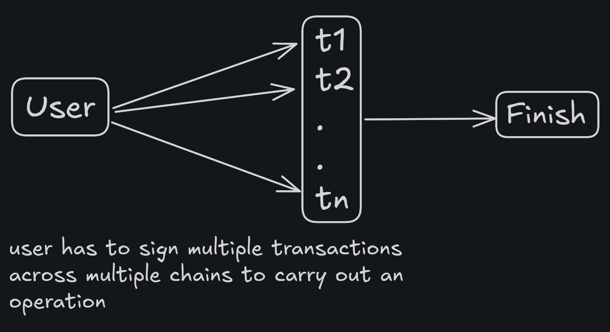
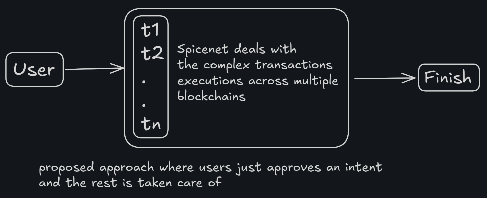
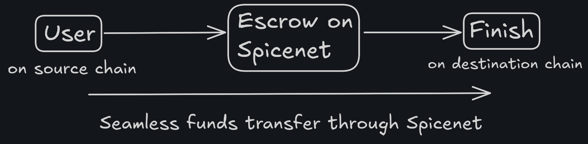
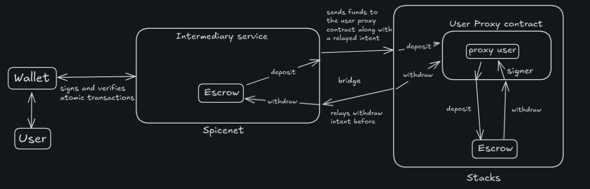
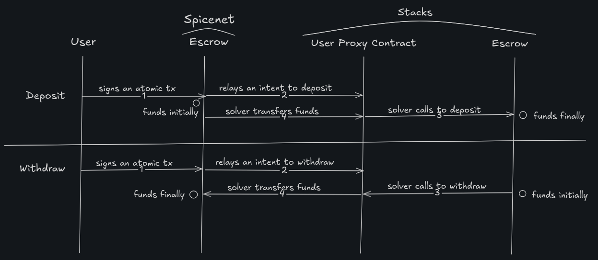
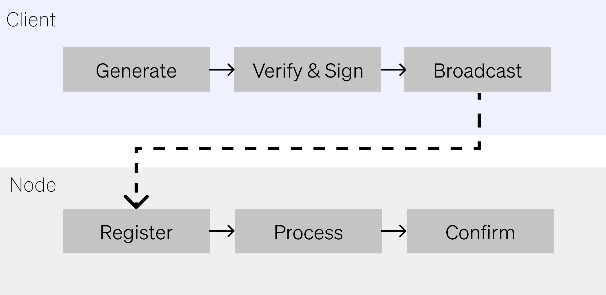

# Delegated transaction execution on Stacks network

This repository contains details and specifications for executing transactions on a user's behalf on the Stacks network when the user chooses to delegate this responsibility to a third party (say Spicenet).

## Normal transaction execution

Here user has to sign multiple transactions individually (could be on multiple chains but here we are focusing on Stacks) to finish job.

## Delegated transaction execution

Here user signs a single transaction (which is taken as a proof of intent) setting a green-light for Spicenet to execute the required set of transactions to finish the job.

## Escrow

In this approach, we maintain an escrow which acts as a medium to transfer user's funds from one chain to another chain. The escrow holds the user's funds until the transaction is confirmed on the target chain, ensuring that the funds are only released when the transaction is successfully executed.
In this case, the destination chain is **Stacks**.

***Here, the middle escrow contract (Spicenet) serves as a intermediary for facilitating the transaction execution between the source and destination chains.***

## Overview

This document outlines a mechanism for executing transactions on the Stacks network on behalf of the user, using an escrow system to securely transfer funds from a source chain to the Stacks network. The process involves the user signing a minimum number of transactions, which are then executed by a third-party intermediary (e.g., Spicenet) to complete the transaction on the Stacks network.

Stacks is a L1 blockchain that uses Clarity smart contracts and is designed to bring programmability to Bitcoin via the **Proof-of-Transfer (PoX)** mechanism. However, there is no EIP-7702 equivalent or alike delegation mechanism in Stacks. The proposed solution allows users to delegate transaction execution to a third party (Spicenet) while ensuring that their funds are securely managed through an escrow system.

On Stacks, we can use proxy contracts to represent users, enabling solvers to execute transactions on their behalf. This approach allows users to interact with the Stacks network without needing to maintain a Stacks wallet or spend additional tokens beyond the initial transaction fee on the source chain. Deposits and withdrawals can be made to and from the Stacks using the escrow contract on Stacks, with delegation achieved through the use of a proxy contracts. This allows solvers to perform actions like transferring tokens from escrow and calling destination contracts "on behalf of" the user, interpreted as executing from a user-mapped proxy address.

## Key components specifications

1. **Escrow Contract on Stacks:**
   - *Purpose:* This contract holds the user's funds deposit/withdrawal action on the Stacks network.
   - *Deposits:* User deposits funds from the source chain via Spicenet, which relays the intent to the Stacks network.
   - *Withdrawals:* User can withdraw funds from the Stacks network back to the source chain via Spicenet, which relays the intent to the Stacks network.
   - *Implementation:* Written in Clarity and uses contract-owned storage for securing user funds. Spicenet maintains a single keypair for escrow authorization.

2. **Delegation mechanism: Proxy Contract on Stacks:**
   - *Purpose:* This contract acts as a proxy for the user, allowing solvers to execute transactions on the user's behalf. To avoid user having to maintain keypairs on Stacks.
   - *Mapping:* The proxy contract holds a mapping of user addresses to their proxy addresses with a deterministic name (e.g., `proxy_<user_address>`).
   - *Functionality:* The proxy contract can call functions on destination contracts, such as executing deposits or withdrawals, while ensuring that the actions are interpreted as being executed from the user's mapped address.
   - *Implementation:* Written in Clarity and uses contract-owned storage for managing user-specific data.

## Setup and Execution Flow

- **Setup process:**
   1. User signs a single atomic intent on the source chain (e.g., approving cross-chain action and delegating execution to Spicenet).
   2. Spicenet relays the intent to the Proxy contract on Stacks, deployed once by Spicenet.
   3. Proxy contract performs a lookup to find the user's mapped address (e.g., `proxy_<user_address>`).
   4. If the proxy contract does not exist, it is created with the user's address as a deterministic name.
   5. Proxy contract includes logic to verify the intent from Spicenet (using a signature or other verification method) and execute the required actions on Stacks.

- **Execution by solvers:**
    1. Solvers monitors Spicenet for intents.
    2. Solver calls the escrow to transfer funds to the user's proxy contract (escrow verifies the relayed intent).
    3. Solver then calls the proxy contract, which internally calls the destination contract (e.g., deposit function) using the transferred funds.
    4. The proxy's principal (contract address) serves as the "user's address" on Stacks, making the call appear from the user in a mapped sense.

- **Verification and security:**
    1. The proxy contract includes logic to verify the intent from Spicenet, ensuring that only valid intents are executed.
    2. The escrow contract ensures that funds are securely held until the transaction is confirmed on the Stacks network.

## Example flow

- **Setup:** User owns 100 USDT on Spicenet and signs a single intent to deposit into the Stacks contract, delegating execution to Spicenet.

- **Relay:** Spicenet rollup relays the intent to the proxy contract on Stacks, which is mapped to the user's address with a deterministic name (e.g., `proxy_<user_address>`).

- **Escrow Transfer:** Solver calls escrow to transfer 100 USDT to the proxy contract (escrow confirms via relayed intent).

- **Delegated Call:** Solver calls a function on the proxy (e.g., execute-deposit), passing destination contract details (stacks escrow contract). Proxy verifies the intent and calls the destination's deposit function, transferring the 100 USDT.

- **Outcome:** The destination contract receives the deposit from the proxy's address, which maps 1:1 to the user's source address. Assuming gas fees is handled by the solver or spicenet, the user doesn't need to hold any STX tokens on Stacks.

***\*The circles represent the position of funds, and the count on arrows represents the order for reading.***

## Alignment with the Ideal Objectives

1. **Not require the user to maintain a keypair except on the source chain:**
    - Fully met. The user never creates or manages a Stacks keypair. The user only needs to sign a single transaction on the source chain.

2. **Not require any token except the user wishes to spend on the source chain:**
    - Fully met. The user only needs to hold the token required to initiate the transaction on the source chain.

3. **Not require any changes to the contract code on the destination chain:**
    - Partially met. The proxy contract on Stacks calls the escrow contract on Stacks on user's behalf as is, but the `tx-sender` (a contract principal) is the proxy, not a standard principal. If the escrow contract expects a standard principal or records `tx-sender`, it may not recognize the proxy as a user which may cause issues.

4. **Not require spicenet to maintain any keypairs except for escrow authorization:**
    - Fully met. Spicenet does not need to maintain any keypairs except for the escrow authorization.

5. **Minimize the number of approvals required by the user:**
    - Fully met. The user only needs to sign a single transaction on the source chain, which is taken as a proof of intent for Spicenet to execute the required set of transactions on the Stacks network. All other transactions on Stacks actions are delegated via relayed intent.

6. **Have an easy, 1:1 mapping between addresses on the destination chain and the original user’s address on the source chain:**
    - Fully met. The proxy contract on Stacks is mapped to the user's address with a deterministic name (e.g., `proxy_<user_address>`), ensuring a 1:1 mapping between addresses on the destination chain and the original user’s address on the source chain.

## Features at a glance

- Doesn't require the user to maintain a Stacks wallet. The user can use any wallet on the source chain to the initiate the transaction.

- Doesn't require the user to spend any token except the token needed to initiate the transaction on the source chain.

- Doesn't require any change to the contract on the Stacks network.

- Doesn't require Spicenet to maintain any keypairs except for the escrow authorization.

- Minimal number of transactions to be signed by the user.

## Stacks network specifics

- **Native token:** STX; smallest unit is microSTX (1 STX = 1,000,000 microSTX)

- Stacks uses Account-based model for managing user accounts, which is more similar to Ethereum rather than a UTXO model as in Bitcoin. Associated properties include:
  - keypair (private and public keys)
  - nonce
  - assets balances (like STX tokens, etc)

- Proof-of-Transfer (PoX) is the block production mechanism used in Stacks.

### Transaction execution on Stacks

***\*Ref: https://docs.stacks.co/concepts/transactions/transactions#lifecycle***

### Clarity smart contracts

Stacks uses Clarity as it's smart contract language. Every entity involved in a transaction is identified by a principal. Principals are fundamental to how Stack identifies ownership, and permissions. There are two main types of principals:

- **Standard Principal:** This is a principal that is associated with a user-controlled accounts. It is used for actions like sending transactions directly from a user's wallet.

- **Contract Principal:** This is a principal that is associated with a Clarity smart contracts. When a contract invokes another contract, the `tx-sender` (a built-in Clarity variable that identifies the originator of the transaction) is set to the 'contract's principal' of the calling contract, not the standard principal of the user.

## Sources

- [Stacks Documentation](https://docs.stacks.co/)
- [EIP-7702](https://eip7702.io/)
- [Clarity GitHub](https://github.com/clarity-lang/overview)
- [Clarity book](https://book.clarity-lang.org/)
 - https://www.quicknode.com/guides/other-chains/stacks/how-to-create-and-deploy-a-clarity-smart-contract-on-the-stacks-blockchain
 - https://www.ortege.ai/news/exploring-stacks-proof-of-transfer-insights-ortegelakehouse-datasets
 - https://chorus.one/articles/an-introduction-to-stacks-the-bitcoin-layer-2-for-smart-contracts-apps-defi
